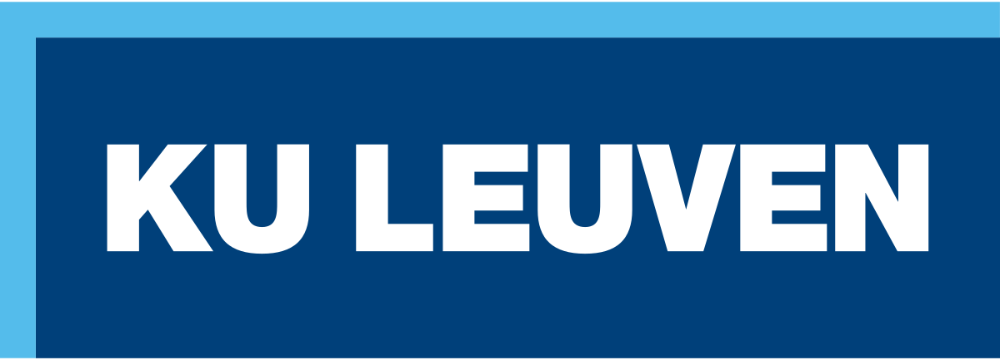
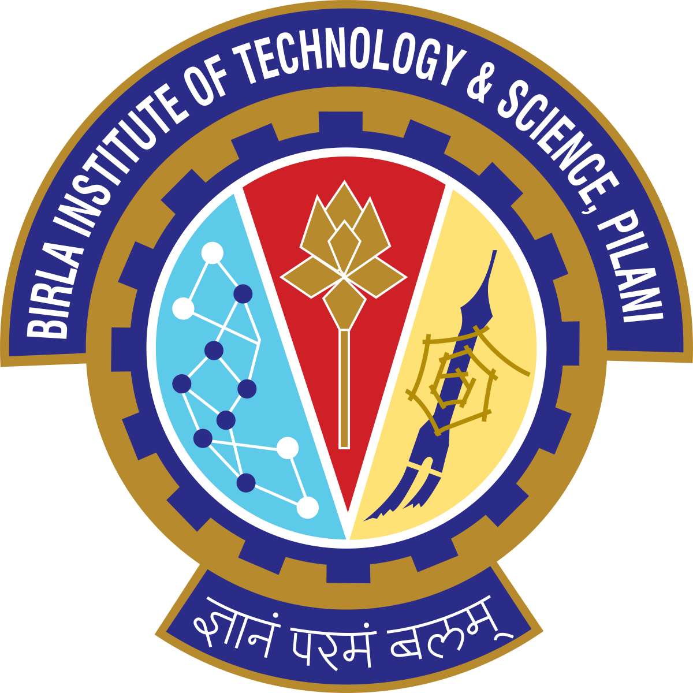
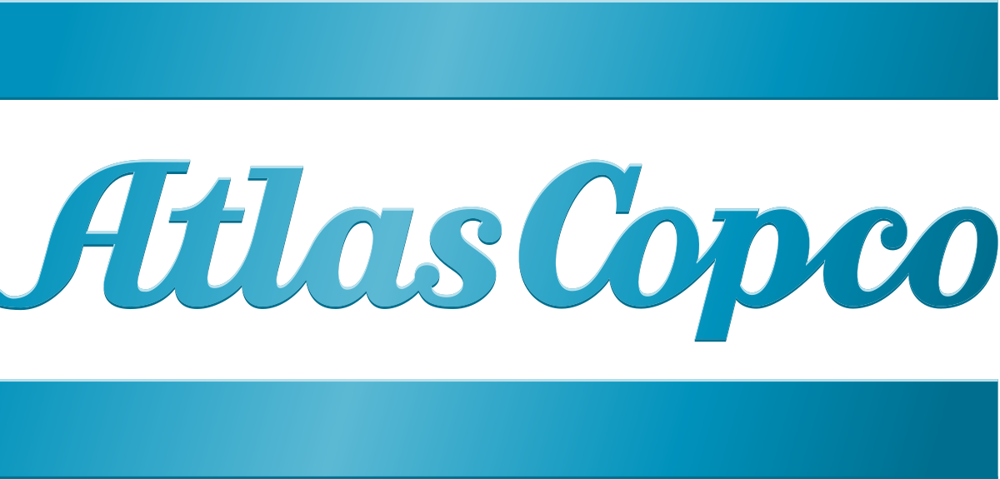
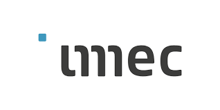
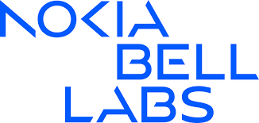
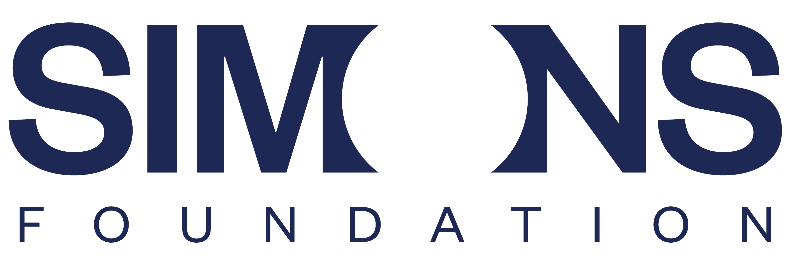

Hi, I'm Prateek Grover.

<figcaption style='text-align: center;'>he/him</figcaption>

I recently completed my Master's in Computer Science at KU Leuven.

I work on computer vision: segmentation, tracking, and multimodal sensing — across research labs where I've run the experiments as well as built the models. 

I also work on the engineering around them: training pipelines, cloud and production infrastructure, and interfaces built for people who don't write code.
 

prateek.grover.in[at]gmail[dot]com &nbsp;·&nbsp; <a href="https://www.linkedin.com/in/prateekgrover-in/">LinkedIn</a> &nbsp;·&nbsp; <a href="https://github.com/prateekgrover-in">GitHub</a>&nbsp·&nbsp; <a href="https://scholar.google.com/citations?user=0JYhJ54AAAAJ&hl=en">Google Scholar</a>

<!--   -->
<!-- <nav class="section-nav" id="sectionNav">
  <a href="#education" class="active">Education</a>
  <a href="#experience">Experience</a>
  <a href="#projects">Projects</a>
</nav> -->

<!-- ══ EDUCATION ══ -->

  
Education

  

    <a class="edu-card" href="/work/kul/" style="text-decoration:none;color:inherit;">
      
      

        
Master's degree Computer Science

        
Katholieke Universiteit Leuven

        
Sep 2023 – Jul 2026 · Leuven, Belgium

      

    </a>
    <a class="edu-card" href="/work/bits/" style="text-decoration:none;color:inherit;">
      
      

        
Bachelor's degree Electrical &amp; Electronics Engineering

        
Birla Institute of Technology and Science, Pilani

        
Aug 2018 – May 2022 · Rajasthan, India

      

    </a>
  

<!-- ══ EXPERIENCE ══ -->

  
Experience

  

    <button class="filter-btn active" data-tag="all">All</button>
    <button class="filter-btn" data-tag="research">Research</button>
    <button class="filter-btn" data-tag="industry">Industry</button>
    <button class="filter-btn" data-tag="ml-cv">ML / AI</button>
    <button class="filter-btn" data-tag="backend">Software</button>
    <button class="filter-btn" data-tag="cloud-devops">Cloud</button>
  

  

    <a class="exp-card" href="/work/atlas-copco/" data-tags="industry cloud-devops backend">
      
      
Platform &amp; DevOps Engineer

      
Atlas Copco Group

      
Oct 2025 – Present · Antwerp, Belgium

      
Built observability for a distributed industrial IoT platform (dashboards, alerting, cross-tenant metrics) and set up Kubernetes clusters with GitOps delivery now running databases and services in development. All managed as infrastructure as code.

      

        IndustrySoftwareCloud
      

      
View details →

    </a>
    <a class="exp-card" href="/work/imec/" data-tags="research ml-cv backend">
      
      
Machine Learning Research Intern

      
Life Sciences Dept., imec

      
Oct 2024 – Jun 2025 · Leuven, Belgium

      
Built a platform letting biologists run and fine-tune segmentation models on their own data without writing code. Ran the wet-lab experiments behind it, producing a novel dataset pairing fluorescence microscopy with impedance recordings.

      

        ResearchML / AISoftware
      

      
View details →

    </a>
    <a class="exp-card" href="/work/nokia/" data-tags="industry backend">
      
      
Software Engineering Intern

      
Nokia Bell Labs

      
Jul 2024 – Aug 2024 · Antwerp, Belgium

      
Designed a microservices system for autonomous monitoring and remediation of broadband network units, and applied hierarchical clustering to infer unknown network topology from connectivity patterns alone.

      

        IndustrySoftware
      

      
View details →

    </a>
    <a class="exp-card" href="/work/walmart/" data-tags="industry backend">
      
      
Software Engineer

      
Walmart Global Technology Services India

      
Jul 2022 – Aug 2023 · Bengaluru, India

      
Extended Sam's Club's shipment tracking platform across domestic and ocean freight — owning testing infrastructure, event pipeline reliability, production alerting, and a greenfield maritime tracking initiative.

      

        IndustrySoftware
      

      
View details →

    </a>
    <a class="exp-card" href="/work/flatiron/" data-tags="research ml-cv">
      
      
Summer Research Associate

      
Center for Computational Biology, Flatiron Institute

      
May 2022 – Jul 2022 · New York, United States

      
Trained generative models to synthesise biological imaging data, and built ConvNets for nuclei tracking and cell-cycle prediction — reconstructing full lineages from time-series microscopy, including through cell division.

      

        ResearchML / AI
      

      
View details →

    </a>
    <a class="exp-card" href="/work/ucf/" data-tags="research ml-cv">
      
      
Research Intern

      
Center for Research in Computer Vision, University of Central Florida

      
Dec 2021 – May 2022 · Florida, United States

      
Benchmarked segmentation models on a novel mouse embryo dataset, then designed U-Net and Vision Transformer architectures using hybrid contour-distance representations to push accuracy past existing baselines. 

      

        ResearchML / AI
      

      
View details →

    </a>
  

<!-- ══ PROJECTS ══ -->

  
Select Projects

  

    

      
Minimal Interpreter for a Domain-Specific Language

      
KU Leuven - Programming Languages

      
Nov 2024 – Dec 2024

      
A lightweight interpreter for a custom language, written in Racket — arithmetic, first-class functions, type checking, and error handling.

    

    

      
Optimised Delivery Routing with Graph Neural Networks

      
KU Leuven - Constaint Solving

      
Oct 2023 – Apr 2024

      
A GNN-guided solver with clustering to optimise delivery routing, improving route similarity and efficiency across 100+ deliveries per day.

    

    

      
Language Models for Structured Data Prediction

      
BITS Pilani - Reseach Project

      
Sep 2021 – Mar 2022

      
Predicted material properties by parsing chemical nomenclature as a structured language, benchmarking transformer models (BERT, RoBERTa) against graph networks for how well each captured semantic structure.

    

    

      
JP Morgan Quant Research Challenge — Winner

      
JPMorgan Chase

      
Aug 2021 – Sep 2021

      
Won the challenge with a model for long- and short-range time-series forecasting of asset prices, used to construct a diversified portfolio.

    

    

      
Real-Time Pose Estimation and Movement Scoring

      
BITS Pilani - Research Project

      
Jun 2021 – Dec 2021

      
Scored martial-arts technique against expert reference recordings: skeletal keypoints from a live webcam feed, normalised for position and body scale, compared by cosine similarity. 

    

    

      
Neuroevolution for Deep Q-Learning

      
BITS Pilani - Neural Networks

      
Mar 2021 – Apr 2021

      
Trained a reinforcement learning agent to play Atari games with a Deep Q-Network, using neuroevolution to search the hyperparameter space rather than tuning by hand.

    

    

      
Corpus Search Engine with Vector Space Ranking

      
BITS Pilani - Natural Language Processing

      
Mar 2021 – May 2021

      
A ranked information retrieval system over a 25k+ document corpus, with a custom in-memory index for low-latency querying and a vector space model using TF-IDF and cosine similarity.

    

  

<button id="work-page-toggle" onclick="workTogglePage()">dark</button>
